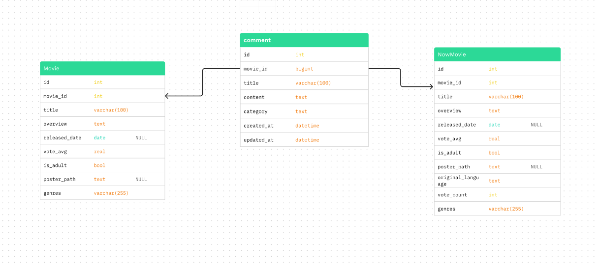

# 최종 관통 프로젝트

### 1. 팀원 정보 및 업무 분담 내역

| 김민아 |정지영|
|:---:|:---:|
|영화 데이터 수집|영화 데이터 정제|
|소통창구(커뮤니티)|영화검색|
|메인화면|영화추천|
|길라잡이(gpt)|영화 상세페이지|

## 2. 목표 서비스 구현 및 실제 구현 정도
> 60%

#### 목표 서비스
[로그인 & 로그아웃 기능]
- [ ] 
  

[커뮤니티 기능]  
+ [X] 인상깊은 포인트 기록하는 게시판 만들기
+ [ ] 게시판에 하트 표시하기
  

[AI]
+ [X] GPT를 이용한 챗봇 서비스
* [ ] GPT를 이용한 데이터베이스 구축
   

[추천 기능]  
* [X] 현재 상영 영화(관람객 많은 순)
* [X] 선택토글 - 장르별 영화 (top20)
  

[검색 기능]
* [X] 검색하고 싶은 영화 검색
* [ ] 세부 검색기능 

## 3. 데이터 베이스 모델링(ERD)

### ERD

### 명세서

## 4. 영화 추천 알고리즘에 대한 기술적 설명
[검색] 
● 해당 키워드가 제목에 존재하는 경우 필터링하여 저장(in)   
[추천1] 현재 상영 중 영화 
● 현재 상영 중인 한국영화이면서 청소년관람불가가 아닌 영화를 사람들이 많이 본 순으로 20개 추천  
[추천2] 장르별 추천 
● 해당 장르의 영화를 사람들이 많이 본 순으로 20개까지 추천(in)

## 5. 핵심기능에 대한 설명

[커뮤니티 서비스]
- 인상깊었던 대상(대사, 인물, 사물, 소리 등)에 대한 의견을 적어 댓글 작성
- 다른 사람들의 의견을 보며 소통

[AI 챗봇서비스]
- 인상깊었던 대상에 대한 의견 묻기
- 궁금한 점을 질문하여 답변받기

[영화 추천]
- 현재 상영중인 영화를 관객수 순으로 20개 추천
- 장르별 영화를 관객수 순으로 20개 추천

[영화 검색]
- 해당 키워드가 제목에 존재하는 경우에 해당 영화들 추천
- 해당 키워드가 포함된 영화가 총 몇 개 존재하는지 알려줌

## 6. 기타(느낀점, 후기등)
- `김민아` : 처음 해보는 개발 프로젝트라 걱정을 많이 했는데 생각보다 만족스러운 과정과 결과가 있었습니다. 나름 웹이라고 할 수 있는 페이지를 처음부터 끝까지 직접 구현했다는 것이 뿌듯했습니다. 
 api 요청을 보내서 json 파일을 만들고 db를 구축하는게 가장 기억에 남습니다. 뭐든지 일단 해보고 안되면 오류를 찾아 해결하거나 다른 방법을 시도해봤던게 좋았습니다.  
 이번 학기동안 배운 것들을 실제로 활용해보면서 다시 한 번 공부하는 느낌이라 더 의미가 있었습니다. 이해할 수 없을 것 같았던 django와 vue에 대해 조금은 알 것 같습니다. FE와 BE를 나누지 않고 처음부터 끝까지 같이 한 것도 좋은 선택이었다고 생각합니다. 혼자서는 할 수 없을 것 같았던 과정들을 너무 즐겁게 하고 보람도 느꼈습니다.똑똑하고 유능한 팀원을 만나서 정말 다행이라고 느꼈고 잘하고 열심히 해주고 저에게 잘 맞춰주기까지 한 팀원에게 진심으로 감사합니다.

 

- `정지영` : BE와 FE 구분 없이 처음부터 기능을 구현해보니 RESTAPI와 Vue의 상호작용에 대해 깊이 이해할 수 있었습니다 처음하는 프로젝트라 처음 기획한대로 진행되지 않고 수정을 거쳐가며 진행되어 아쉬웠습니다. 이번 경험을 통해 다음 프로젝트는 더 체계적으로 진행될 수 있도록 하겠습니다.  
DB의 데이터를 정제하고 원하는 데이터만 추출하는 방법, post요청 시 토큰 설정 방법 등에 대해 알게 된 프로젝트였습니다.  
생각보다 기간이 짧아 로그인, 로그아웃 등을 구현하지 못한 점이 아쉬움으로 남아 페어와 함께 방학동안 이어서 해볼 것 같습니다.  
또한 문자열 기반 알고리즘을 적용해 볼 것 같습니다.  
10번의 프로젝트에 대한 결과물을 보니 한학기동안 열심히 공부한 것 같아 뿌듯합니다.  
난관에 부딪혔을 때 페어와 함께 고민하는 시간들이 의미있었고 그 과정에서 많이 배웠던 것 같아 앞으로의 프로젝트가 기대됩니다. 
